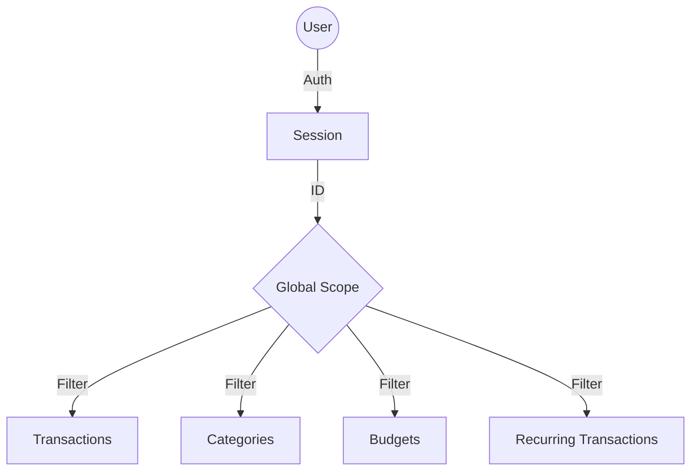
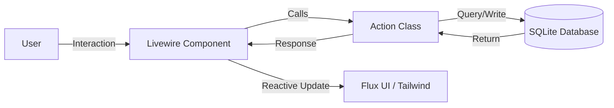
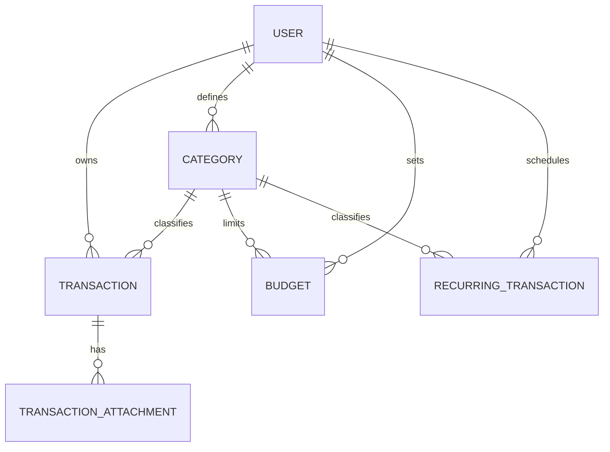

# Nomos

Nomos is a personal finance management web application for individual users. It provides a single place to track income and expenses, set budgets, manage recurring bills, and understand spending behaviour through analytics and insights.

## 🚀 Key Features

- **Dashboard**: High-level overview of financial health with summary cards, weekly spending bar charts, and top category breakdowns.
- **Transaction Tracking**: Fast entry of income and expenses with support for file attachments (receipts, invoices).
- **Personalized Categories**: Full per-user category management. New users are automatically seeded with a standard set of 21 default categories.
- **Monthly Budgeting**: Set per-category budget limits with real-time progress indicators (Green/Yellow/Red).
- **Recurring Transactions**: Automation of recurring bills and income with a "Confirm/Skip" workflow to generate actual transactions.
- **Financial Insights**: Deep-dive analysis including daily spending trends, weekday vs weekend patterns, and data-driven recommendations.
- **Reporting**: Visual spending reports and CSV exports for transaction history.

## 🛠 Tech Stack

- **Backend**: Laravel 13, PHP 8.4, SQLite
- **Frontend**: Livewire 4, Flux UI, Tailwind CSS 4, Alpine.js
- **Auth**: Laravel Fortify (2FA, Email Verification)

## 🏗 Architecture

### Data Isolation
Nomos ensures strict data privacy. All user-owned entities are scoped to the authenticated user using Eloquent Global Scopes.



### Component Logic
The app uses a Single-File Component (SFC) architecture for Livewire, combining PHP logic and Blade templates.



### Core Entity Relationships



## ⚙️ Installation

1. **Clone & Setup**
   ```bash
   git clone <repo-url>
   composer install
   npm install
   cp .env.example .env
   ```

2. **Database & Assets**
   ```bash
   php artisan migrate --seed
   npm run dev
   ```

3. **Access**
   The site is served via Laravel Herd at `http://nomos.test`.

## 📝 Development Guidelines

- **Logic**: Business logic must reside in `app/Actions/` rather than directly in Livewire components.
- **Styling**: Use Tailwind CSS 4 utility classes.
- **Testing**: Every feature must have a corresponding Pest test in `tests/Feature/`.
- **Formatting**: Run `vendor/bin/pint` before committing.
