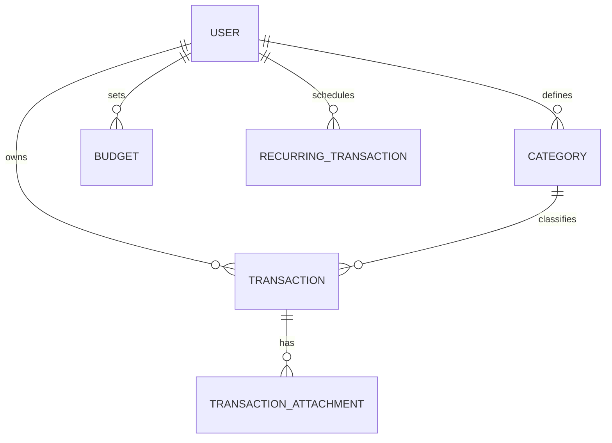

# Nomos

Nomos is a personal finance management web application. Track income and expenses, set budgets, manage recurring bills, and understand spending behaviour through analytics and insights.

## Tech Stack

- **Backend:** Laravel 13, PHP 8.4, SQLite
- **Frontend:** Livewire 4 SFC, Flux UI v2, Tailwind CSS 4, Alpine.js
- **Auth:** Laravel Fortify (2FA, email verification)
- **Dev:** Laravel Herd, Pest v4

## Features

- **Dashboard** — summary cards, weekly spending chart, top categories, recent transactions, recurring pending banner, Add Transaction FAB
- **Transactions** — paginated list with search/filter/sort, income/expense CRUD, file attachments, CSV export, income cha-ching sound
- **Categories** — per-user categories, seeded with 21 defaults on registration
- **Budget** — per-category monthly budgets with Green/Yellow/Red progress indicators
- **Recurring Transactions** — Confirm/Skip workflow, daily/weekly/monthly/yearly frequencies
- **Reports** — bar chart by month or category, transaction report with category breakdown
- **Insights** — spending trends, weekday patterns, category movement, data-driven recommendations
- **Settings** — profile, appearance (dark/light), security (password, 2FA TOTP)

## Architecture

### Component Structure

All Livewire components use Single-File Component (SFC) format with ⚡ prefix:

```
resources/views/components/
├── pages/          # Full-page SFC components (dashboard, insights)
├── transactions/   # Transaction-specific SFC components
├── dashboard/      # Blade-only sub-components (props only, no Livewire)
└── *.blade.php     # Reusable SFC components (budget, recurring, etc.)
```

### Actions Pattern

Business logic lives in `app/Actions/` — not in Livewire component methods:

```
app/Actions/
├── CreateTransactionAction
├── UpdateTransactionAction
└── DeleteTransactionAction
```

### Data Isolation

All user-owned entities are scoped to the authenticated user. Categories use `UserCategoryScope` global scope.


```mermaid
erDiagram
    USER ||--o{ TRANSACTION : owns
    USER ||--o{ CATEGORY : defines
    USER ||--o{ BUDGET : sets
    USER ||--o{ RECURRING_TRANSACTION : schedules
    CATEGORY ||--o{ TRANSACTION : classifies
    TRANSACTION ||--o{ TRANSACTION_ATTACHMENT : has
```

## Installation

```bash
git clone <repo-url>
composer install
npm install
cp .env.example .env
php artisan key:generate
php artisan migrate --seed
npm run build
```

Served via Laravel Herd at `http://nomos.test`.

## Development

```bash
composer run dev   # starts Herd + Vite dev server
php artisan test --compact   # run tests
vendor/bin/pint --dirty      # format changed PHP files
```

## Guidelines

- Business logic → `app/Actions/`, not Livewire methods
- Raw SQL date ops → `strftime()` (SQLite, not MySQL)
- Routes → always use named routes via `route()` helper
- Tests → Pest feature tests in `tests/Feature/`, run after every change
